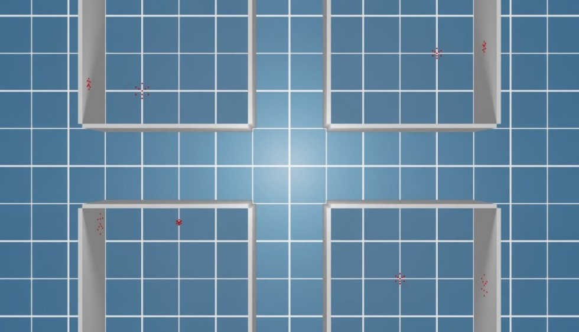
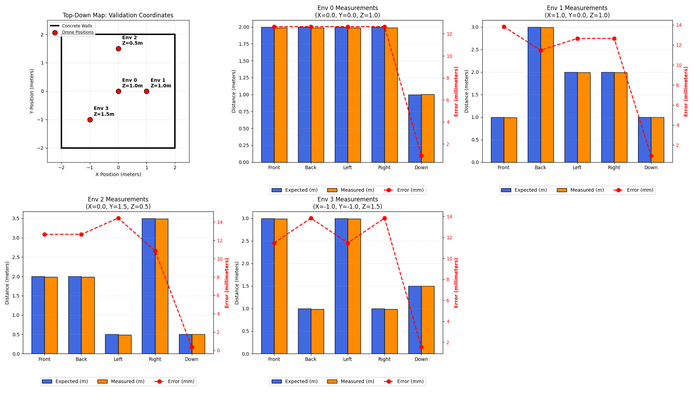
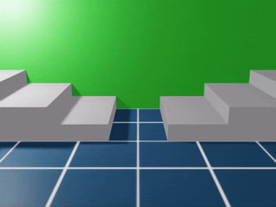
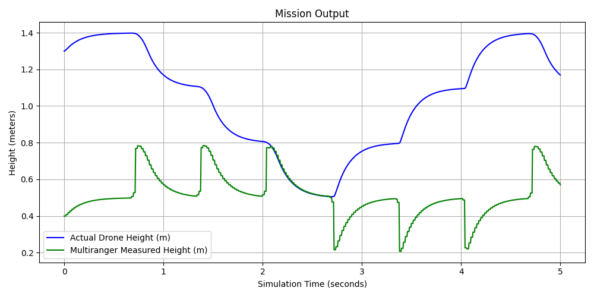
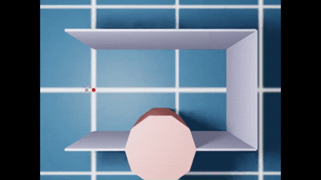
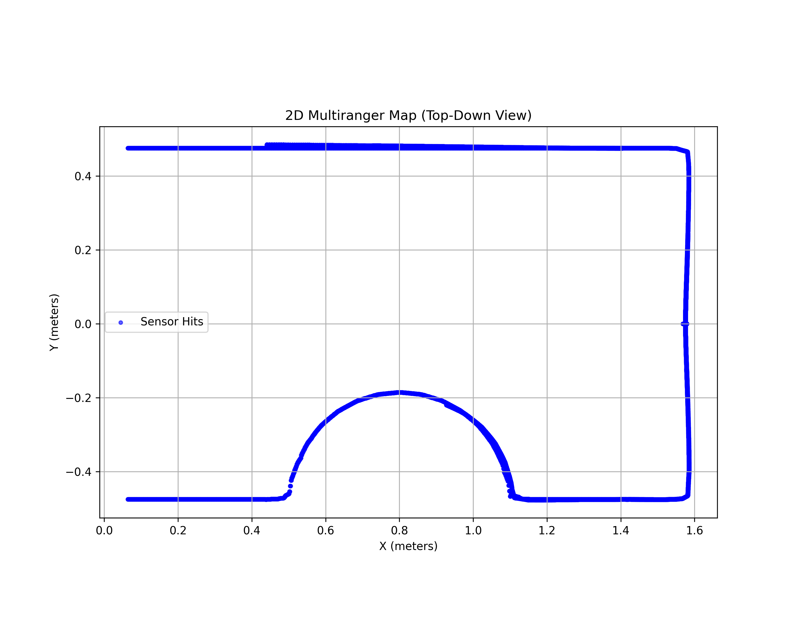

# Custom Multiranger Deck Sensor for Isaac Lab

This repository contains the implementation of a custom Time-of-Flight (ToF) Multiranger Deck sensor for NVIDIA Isaac Lab. The sensor simulates a 5-directional distance measurement system (Front, Back, Left, Right, Up/Down), inspired by drone hardware like the Crazyflie Multiranger Deck.

## 1. Installation Requirements

### Hardware Requirements
* **GPU:** NVIDIA RTX GPU (Minimum 8GB VRAM recommended for raycasting simulation).
* **RAM:** 16GB minimum (32GB recommended).

### Software Requirements
* **OS:** Ubuntu 20.04 / 22.04 (or Windows 11 with WSL2).
* **Simulator:** Omniverse Isaac Sim (v2023.1.1 or later).
* **Framework:** NVIDIA Isaac Lab (installed from source).
* **Python:** Python 3.10+.

### Installation
This is an "out of tree" package so it must be installed outside of the IsaacLab directory. The process is as follows:
1. Install Isaac Lab following the [official guide](https://isaac-sim.github.io/IsaacLab/main/source/setup/installation/index.html)
2. Activate your Isaac Lab virtual environment.
3. Navigate to the root of the repository's folder.
4. From terminal run:
```bash
pip install -e .
```
   so that the repositories packages can be accessed from anywhere (e.g. the numpy libraries)

## 2. Key Features
* **Realistic Behaviour:** Since true photon time-of-flight cannot be directly simulated, the VL53L1X sensor behavior is replicated by casting a multi-ray cone against the environment meshes. The system calculates a center-weighted average of the hit distances, which is then strictly clamped to the hardware's 4.0-meter limit
* **Modular Resolution:** The Field of View (FoV) and the number of individual rays per cone are fully modular in the config classes. The actual VL53L1X has a FoV range of 27°-15°.
* **Universal Collision Detection:** Powered by the `MultiMeshRayCaster`, the sensors seamlessly detect both computationally efficient primitive shapes (spheres, cubes) and complex, triangulated 3D meshes as well as static and dynamic meshes.

## 3. Repository Structure
Project is strictly organized to separate core logic, execution scripts, and documentation:

```
MultirangerDeck/
├── .gitignore                     # Untracked files and cache exclusions
├── README.md                      # Project documentation
├── setup.py                       # Python package installation script
│
├── source/                        # Core Multiranger Deck Sensor Package
│   ├── __init__.py
│   ├── multiranger_deck.py        # Main raycaster sensor class
│   ├── multiranger_deck_cfg.py    # Sensor configurations
│   ├── multiranger_deck_data.py   # Data container for range outputs
│   └── patterns/                  # Raycast pattern generators
│       ├── __init__.py
│       └── multiranger_deck_patterns.py # Math for the 27° 5-cone FoV
│
├── scripts/                       # Executable Isaac Lab Scenarios
│   ├── demo1_wall_validation.py   # Static teleportation accuracy test
│   ├── demo2_pyramid_hover.py     # Dynamic terrain following and altitude test
│   ├── demo3_pointcloud.py        # Hardware-Truth Point Cloud Mapping
│   │
│   └── quacopter_control/         # Flight controller logic
│       └── flight_controller.py   # Cascaded PID (Altitude, Pitch, Roll, Yaw)
│
└── multimedia/                    # Output telemetry, plots, and videos
    ├── ...                         # photos and videos of the demos
```

## 4. Usage
We have prepared three progressive demonstrations to validate the sensor. To run them, open your terminal, activate the Isaac Lab environment, and execute the scripts from the repository root.

1.  Navigate to the root of isaac lab directory:
   `cd ~/IsaacLab`

2. To run the demo simmulation:

    -Demo 1: Basic Wall Validation
    Tests the sensor's basic directional measurements in multiple static environments across multiple drone spawn coordinates.

    `./isaaclab.sh -p /path to your folder/MultirangerDeck/scripts/demo1_wall_validation.py --headless --enable_cameras`
<p align="center">
  
   
</p>

    -Demo 2: Dynamic Pyramid Hover (Terrain Following)
A dynamic simulation where a drone uses the Z-down sensor reading in a control loop to maintain a stable target altitude over uneven, multi-level pyramidal terrain.

    `./isaaclab.sh -p /path_to_your_folder/MultirangerDeck/scripts/demo2_pyramid_hover.py --headless --enable_cameras`
<p align="center">
  
   
</p>
    -Demo 3: Hardware-Truth Point Cloud Mapping
A flight mission down a corridor where the drone uses its real-time 1D multiranger readings and its global orientation quaternion to generate and plot an accurate 2D map (point cloud) of the environment.
   
    `./isaaclab.sh -p /path_to_your_folder/MultirangerDeck/scripts/demo3_pointcloud.py --headless --enable_cameras`
<p align="center">
  
   
</p>

## 5. Credits
Authors: Alexandru Zaporojanu, Luca Samorì, and Tommaso Tieri.
Framework: Built using the NVIDIA Isaac Lab framework.

Hardware Inspiration: Logic and configuration inspired by the Bitcraze Crazyflie Multiranger Deck.
